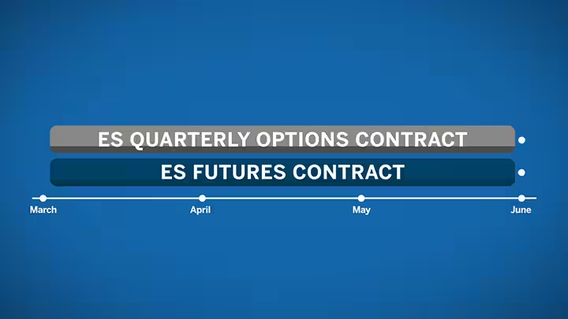
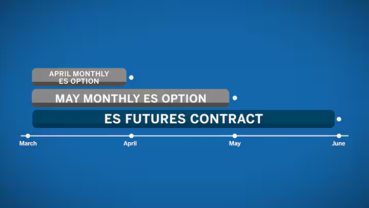
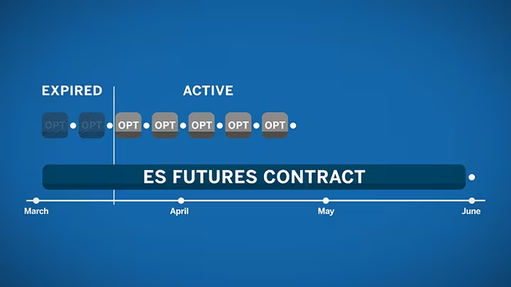
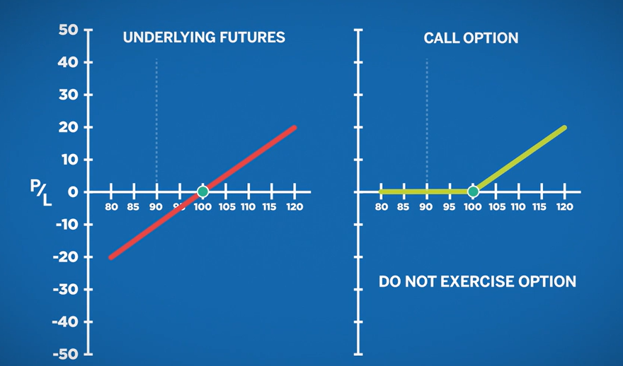

# Introduction to Options

### What is an Option?

An option on a futures is the right (not the obbligation) to buy/sell the underlying futures at a pretedermined price on or before a given date.

The right to exercise the option has a price, called the price premium. Think about it as the cost of having the right to do something, quite similar to an insurance.

Option buyers pay teh premium to the seller, who gets the premium but also beras the risk of price movements. You can see that options can be used like: (1) insurance policies to limit losses; (2) speculative contracts as you can sell options to receive a premium; (3) hedging instruments bu offsetting gains in face of adverse price actions.

### Contract Details

The most important details are:

- Underlying: which can be a futures, interest rates, ...
- Expiration/Maturity date: this is the last day on which an option can be exercised into teh underlying
- Strike price: the agreed price at which the transaction will (if) occur.
- Type: we can have a call option (right to buy at the strike price) or a put option (right to sell at the strike price)

### Options on Futures

Very few new futures contracts are listed on major exchanges without an associated option contract. Hedgers and speculators alike spend a great deal of time examining price behavior unique to each underlying futures contract. Historic price data along with other statistics, such as open interest, volatility, delta, etc., are useful in choosing the strike price and time frame for an option contract.

Both futures and options on futures are called derivatives because they “derive” their value from something other than themselves. An option on a future is no different in this regard, but the underlier is another derivative.

Option contracts span a variety of asset classes, including Interest Rates, Equity Indexes, Foreign Exchange, and physical commodities. In each case, the underlying contract influences the value of the option: the strike range, the premium, and the timing for each option. Doing your homework on the underlying futures contract, may help you identify opportunities in the associated options contracts.

### Strike Price

When picking an option you can choose froma a range of strike prices set by the exchange which are dynamically updated depending on the movements of the undrlying, and withing certain products the strike changes depending on the expiration. For example, options on corn futures have an interval of 0.05 USD for the two front months and then of 0.1 USD intervals for contracts of three months or more.

Generally, the full range of strik prices is determined by the previous day's daily settlement price for the underlying futures. Granularity of possibile strike prices can increae due to large market movements of proximity to expiration.

### Expiration (Maturity) Date

Options are tied to the underlying, thus if the futures expires clearly also the option does. 

When it comes to options on futures, there may be a variety of option expiration dates for the same futures contract.

Some option expirations align with the expiration of the underlying futures contract. In other cases a futures product could have a variety of shorter term options listed. These shorter term options offer traders greater precision and flexibility to expand their trading strategies.

Let's see some examples considering options on the ES futures.

- Quarterly options contracts are offered on the E-mini S&P 500 futures contract. In this case the June quarterly option contract would expire at the same time as the futures contract.

- Monthly contracts are also offered for the same futures product. With a monthly option contract you can express a short term opinion on this longer dated futures contract. For each listed month, such as May and April, you can trade an option that will expire within a month and settles into the same June ES futures contract. 

- There are also weekly options on the E-mini S&P 500 futures contract. A rolling list of five weekly options that expire each Friday is offered on most products. After each weekly front-end contract expires, another back-end weekly is listed. 

For physically-delivered commodities, option expirations will expire prior to the futures settlement. This happens so that traders have an opportunity to mitigate delivery of the physical product. For example, when WTI Crude Oil futures settle in June, the WTI option will have a May expiration date. If the option is exercised into the active futures contract, the trader has time to adjust their futures position to either offset the position or make plans to take delivery.

### Call Options

